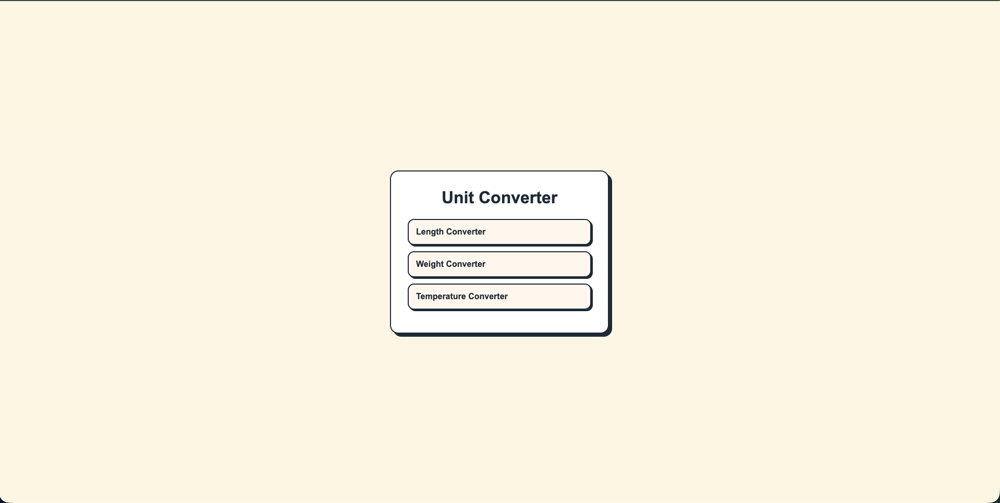
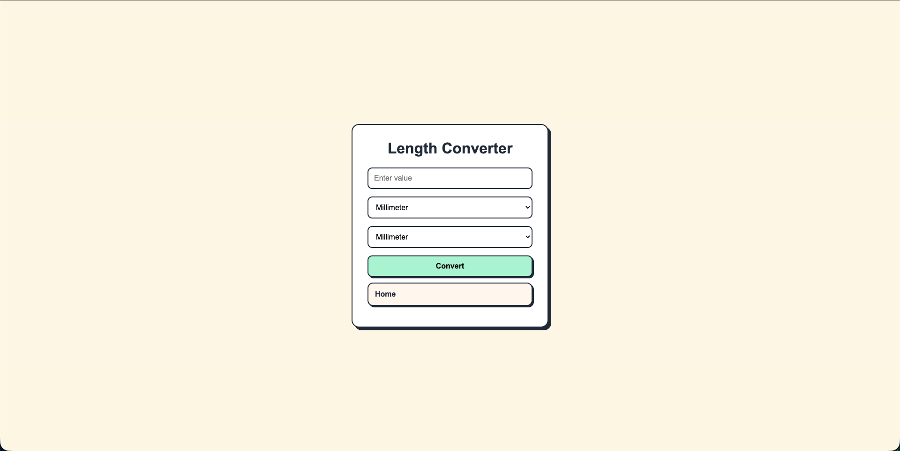

# Unit Converter

A simple web-based unit converter built with Java, Spring Boot, and Thymeleaf. This project allows users to convert between common units of length, weight, and temperature through a clean server-rendered web interface.

## Features

* Convert length units:

    * Millimeter
    * Centimeter
    * Meter
    * Kilometer
    * Inch
    * Foot
    * Yard
    * Mile

* Convert weight units:

    * Milligram
    * Gram
    * Kilogram
    * Ounce
    * Pound

* Convert temperature units:

    * Celsius
    * Fahrenheit
    * Kelvin

* Server-rendered pages using Thymeleaf

* Form handling with Spring MVC

* Separate controller and service layers

* Shared CSS styling across all pages
## Screenshot
Below is a preview of the Unit Converter web interface:


## Technologies Used

* Java
* Spring Boot
* Spring MVC
* Thymeleaf
* HTML
* CSS
* Maven

## Project Structure

```text
src/main/java/com/sahil/unitconverter
├── UnitConverterApplication.java
├── controllers
│   └── UnitController.java
└── services
    └── UnitConverterService.java

src/main/resources
├── static
│   └── style.css
└── templates
    ├── home.html
    ├── length.html
    ├── weight.html
    └── temperature.html
```

## What I Learned

This project helped me practice the fundamentals of building a Spring Boot web application, including:

* Creating controllers with `@Controller`
* Handling GET and POST requests
* Reading form input with `@RequestParam`
* Passing data from Java to Thymeleaf using `Model`
* Separating business logic into a service class
* Using a shared CSS file for consistent styling
* Running a Spring Boot application with embedded Tomcat

## How to Run

1. Clone the repository:

```bash
git clone https://github.com/Sahil-O-Dev/unit-converter.git
```

2. Move into the project folder:

```bash
cd unit-converter
```

3. Run the application:

```bash
./mvnw spring-boot:run
```

On Windows, use:

```bash
mvnw.cmd spring-boot:run
```

4. Open the app in your browser:

```text
http://localhost:8080
```

## Future Improvements

* Format results to reduce long decimal outputs
* Add more unit categories
* Add input validation for invalid values
* Improve responsive design for mobile devices

## Author

Sahil Omarkhel
